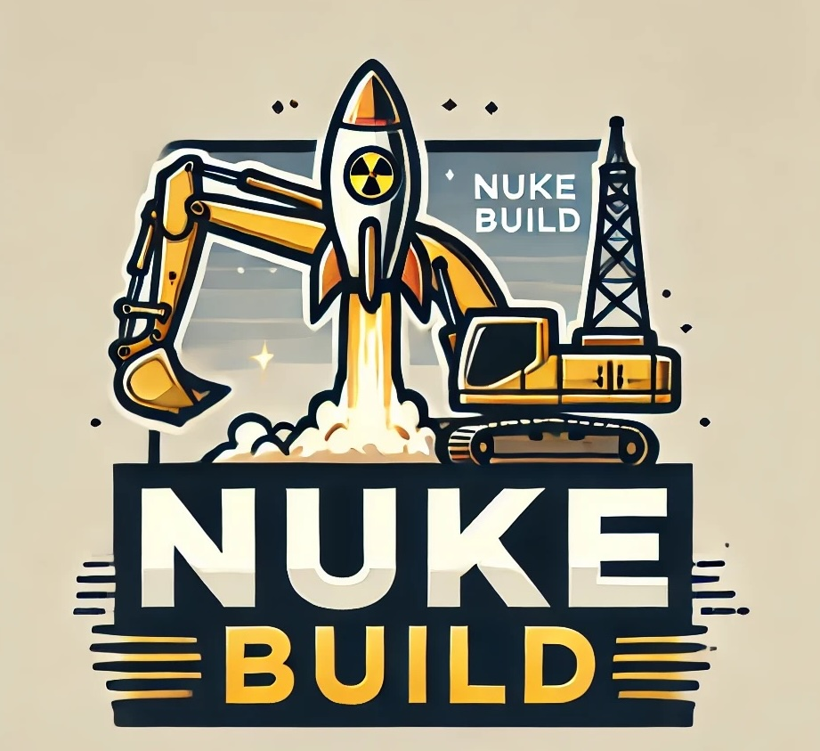
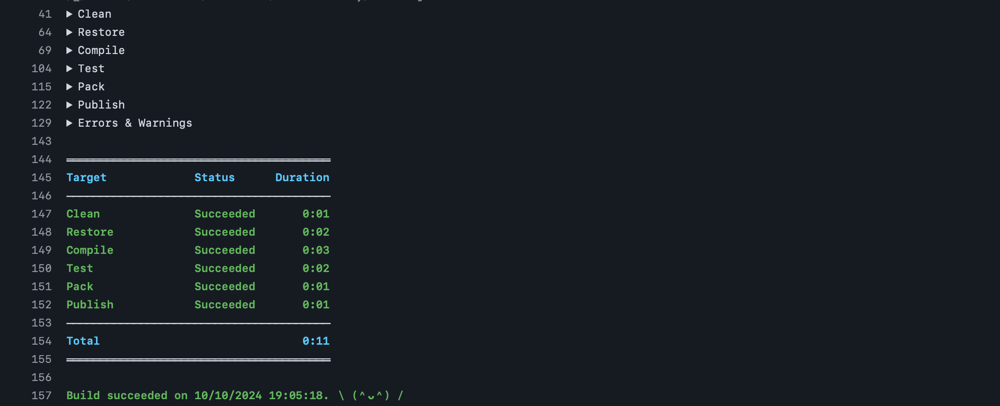
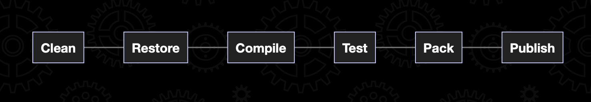

# Nuke Build: Supercharge Your DevOps Workflow with Code-Driven Automation


*[Kevin Slingerland, oktober 2024.](https://github.com/hanaim-devops/blog-student-naam)*
<hr/>


Nuke Build is een cross-platform buildautomatiseringstool die ontwikkelaars in staat stelt om buildprocessen te definiëren met behulp van reguliere C#-code. In tegenstelling tot traditionele buildtools zoals MSBuild of Make, die gebruikmaken van XML of Makefiles, maakt Nuke Build gebruik van de volledige kracht van het .NET-ecosysteem. Dit betekent dat je profiteert van typeveiligheid, IntelliSense en andere voordelen van moderne IDE's.


## Waarom kiezen voor Nuke Build 🚀

Nuke Build biedt een modern alternatief voor tools zoals MSBuild, Make of Cake. De voordelen zijn onder andere:

### Code-Driven Builddefinities 📄

Met Nuke Build schrijf je je buildscripts in C#, wat zorgt voor:

- **Typeveiligheid**: Fouten worden tijdens het compileren opgespoord.
- **IDE-ondersteuning**: Gebruik van IntelliSense, debugging en code-navigatie.
- **Hergebruik**: Maak gebruik van bestaande bibliotheken en methoden.

_Voorbeeld van een eenvoudige target in Nuke_
```csharp
Target Clean => _ => _
    .Executes(() =>
    {
        EnsureCleanDirectory(OutputDirectory);
    });
```

### Naadloze Integratie met .NET

Nuke Build integreert soepel met het .NET-ecosysteem:

- **NuGet-ondersteuning**: Eenvoudig pakketten beheren.
- **MSBuild-integratie**: .NET-projecten worden naadloos gebouwd.

### Developer Comfort

- **Geïntegreerde Documentatie en IDE-ondersteuning**: Functies zoals code-aanvulling, (remote) debuggen en inline documentatie verbeteren de ontwikkelaarservaring.
- **Overzichtelijkheid**: Door het gebruik van C#-code blijft het buildproces inzichtelijk en onderhoudbaar.

---

## Aan de slag met Nuke Build



### Vereisten

- .NET SDK 6.0 of hoger [Download .NET](https://dotnet.microsoft.com/en-us/download)
- *Optioneel: [IDE Extention]()*

### Aan de slag met Nuke: Installeren van de GlobalTool

Om te beginnen met Nuke Build wordt eerst de GlobalTool geïnstalleerd. Deze tool geeft toegang tot Nuke en bevat een aantal handige functies. Om een nieuw project op te zetten, wordt het volgende commando uitgevoerd:

```shell
dotnet tool install Nuke.GlobalTool --global
```
Vervolgens wordt de setup van Nuke gestart met:

```shell
nuke :setup
```


(Koch, z.d., sec. Get Started in Seconds)


### Anatomie: Welke onderdelen zijn er?
Voor de eerste opzet wordt gebruikgemaakt van de standaardsetup van Nuke. Er wordt geërfd van NukeBuild, targets worden gegenereerd en binnen deze targets wordt een commando aangeroepen uit het Nuke.Common-pakket. Laten we deze onderdelen ontleden.

NukeBuild-anatomie:


- **NukeBuild Structuur**:

```csharp
public static int Main() => Execute<Build>(x => x.Compile);
```

Nuke Build levert een aantal basisproperties om inzicht te krijgen in verschillende aspecten van de build en biedt ook events.

- **Build Environment**
```csharp
abstract class NukeBuild
{
    static Host Host { get; }
    static bool IsLocalBuild { get; }
    static AbsolutePath RootDirectory { get; }
    static AbsolutePath TemporaryDirectory { get; }
    // ...
}
```

- **Build Status**
```csharp
abstract class NukeBuild
{
    IReadOnlyCollection<ExecutableTarget> InvokedTargets { get; }
    bool IsSuccessful { get; }
    bool IsFailing { get; }
    IReadOnlyCollection<ExecutableTarget> ExecutionPlan { get; }
    // ...
}
```

- **Build Events**
```csharp
abstract class NukeBuild
{
    virtual void OnBuildCreated();
    virtual void OnBuildInitialized();
    virtual void OnTargetRunning(string target);
    // ...
}

```

- **Target Definities**

Binnen een `Build` -class kunnen buildstappen worden gedefinieerd als `Target` -properties. De implementatie voor een buildstap wordt geleverd als een lambda-functie via de `Executes` -methode.
```csharp
class Build : NukeBuild
{
    public static int Main() => Execute<Build>();

    Target MyTarget => _ => _
        .Executes(async () =>
        {
            await Console.Out.WriteLineAsync("Hello!");
        });
}
```
Targets kunnen ook asynchroon worden geschreven.

<div class="warning">

Asynchrone targets zijn een gemaksfunctie die het gebruik van asynchrone API's op een eenvoudige manier mogelijk maakt. Achter de schermen worden ze nog steeds synchroon uitgevoerd.

</div>


- **Nuke.Common**:

Het Nuke.Common-pakket biedt een verzameling handige functies zoals `DotNetClean()`, `DotNetRestore()` en `DotNetBuild()`. Hiermee kunnen standaard buildtaken worden uitgevoerd zonder complexe shell-opdrachten. Het zorgt voor herbruikbaarheid en maakt het buildscript eenvoudig leesbaar.

---

### Opzetten van de Buildconfiguratie

Voor de volledige uitwerking van de demo vind je de bijbehoorden code terug op [GitHub](https://github.com/KSlingerland/NukeSupercharge)

Als eerste wordt de setup van Nuke uitgevoerd. Er wordt een nieuw project binnen de solution gegenereerd dat wordt aangepast om Nuke binnen GitHub Actions te laten draaien met geïntegreerde CI/CD-ondersteuning. Ook wordt ervoor gezorgd dat de code wordt getest en gepackt om vervolgens te worden gepubliceerd naar NuGet. Dit alles zonder complexe bash-scripts of andere ingewikkelde processen die veel cognitieve belasting opleveren.

Hieronder is de output van de Nuke-setup te zien (Kempé, 2024, sec. What code is generated?):

```csharp
class Build : NukeBuild
{
    public static int Main() => Execute<Build>(x => x.Compile);

    Target Clean => _ => _
        .Executes(() =>
        {
            DotNetClean();
        });

    // Rest van de standaard gegenereerde targets
}
```

Om er een volledige CI/CD-pipeline van te maken, worden de volgende targets toegevoegd:
- **Test**
- **Pack**
- **Publish**

Daarnaast moeten er een aantal variabelen worden geconfigureerd. Dit kan in Nuke relatief eenvoudig worden gedaan met behulp van buildproperties:

- **Solution**: Verwijzing naar de solutionfile
- **GitVersion**: Automatische versiebeheerinformatie.
- **ArtifactsDirectory**: Locatie voor outputbestanden.
- **Configuration**: Buildconfiguratie (Debug of Release).

```csharp
class Build : NukeBuild
{
    // Define the solution file
    [Solution] readonly Solution Solution;

    // GitVersion for versioning
    [GitVersion] readonly GitVersion GitVersion;

    // Define artifacts directory
    AbsolutePath ArtifactsDirectory => RootDirectory / "artifacts";

    // Define configuration
    readonly Configuration Configuration = IsServerBuild
        ? Configuration.Release
        : Configuration.Debug;

    //Bestaande code....
}

```

En de targets worden aangevuld en aangepast tot de volgende configuratie:

```csharp
class Build : NukeBuild {

    //Build variables.....


    public static int Main() => Execute<Build>(x => x.Publish);


    // Clean the project and artifacts
    Target Clean => _ => _
        .Executes(() =>
        {
            ArtifactsDirectory.CreateOrCleanDirectory();
            DotNetClean(s => s
                .SetProject(Solution));
        });

    // Restore dependencies
    Target Restore => _ => _
        .DependsOn(Clean)
        .Executes(() =>
        {
            DotNetRestore(s => s
                .SetProjectFile(Solution));
        });

    // Compile the solution
    Target Compile => _ => _
        .DependsOn(Restore)
        .Executes(() =>
        {
            DotNetBuild(s => s
                .SetProjectFile(Solution)
                .SetConfiguration(Configuration)
                .EnableNoRestore());
        });

    // Run unit tests
    Target Test => _ => _
        .DependsOn(Compile)
        .Executes(() =>
        {
            DotNetTest(s => s
                .SetProjectFile(Solution)
                .SetConfiguration(Configuration)
                .EnableNoBuild()
                .SetResultsDirectory(ArtifactsDirectory / "test-results"));
        });

    Target Pack => _ => _
        .DependsOn(Test)
        .Executes(() =>
        {
            DotNetPack(s => s
                .SetProject(Solution)
                .SetConfiguration(Configuration)
                .SetOutputDirectory(ArtifactsDirectory));
        });

    // Publish the NuGet package
    Target Publish => _ => _
        .DependsOn(Pack)
        .Executes(() =>
        {
            DotNetNuGetPush(s => s
                .SetTargetPath(ArtifactsDirectory / "*.nupkg")
                .SetSource("https://api.nuget.org/v3/index.json")
                .SetApiKey(EnvironmentInfo.GetVariable<string>("NUGET_API_KEY")));
        });

}
```
---

### CI/CD-integratie 🚀

Nuke Build biedt out-of-the-box ondersteuning voor integraties met CI/CD-pipelines van grote aanbieders zoals:

- **AppVeyor**
- **Azure Pipelines**
- **Bitbucket**
- **GitHub Actions**
- **GitLab**
- **Jenkins**
- **Space Automation**
- **TeamCity**

Om de build aan te passen voor gebruik met GitHub Actions, wordt een attribuut toegevoegd aan de `Build` -class (Rodney Littles II - Building GitHub Actions With Nuke, z.d.):

```csharp
[GitHubActions(
    "ci",
    GitHubActionsImage.UbuntuLatest,
    On = new[] { GitHubActionsTrigger.Push, GitHubActionsTrigger.PullRequest },
    InvokedTargets = new[] { nameof(Publish) },
    ImportSecrets = new[] { "NUGET_API_KEY" }
)]
class Build : NukeBuild {

    //Target definitions...

}
```

Met deze wijziging wordt het mogelijk gemaakt voor Nuke om het volgende CI-bestand te genereren. Dit wordt direct in de juiste map geplaatst, zodat het wordt uitgevoerd bij de eerstvolgende push naar de repository.

```yml
# ------------------------------------------------------------------------------
# <auto-generated>
#
#     This code was generated.
#
#     - To turn off auto-generation set:
#
#         [GitHubActions (AutoGenerate = false)]
#
#     - To trigger manual generation invoke:
#
#         nuke --generate-configuration GitHubActions_ci --host GitHubActions
#
# </auto-generated>
# ------------------------------------------------------------------------------

name: ci

on: [push, pull_request]

jobs:
  ubuntu-latest:
    name: ubuntu-latest
    runs-on: ubuntu-latest
    steps:
      - uses: actions/checkout@v4
      - name: 'Cache: .nuke/temp, ~/.nuget/packages'
        uses: actions/cache@v4
        with:
          path: |
            .nuke/temp
            ~/.nuget/packages
          key: ${{ runner.os }}-${{ hashFiles('**/global.json', '**/*.csproj', '**/Directory.Packages.props') }}
      - name: 'Run: Publish'
        run: ./build.cmd Publish
        env:
          NUGET_API_KEY: ${{ secrets.NUGET_API_KEY }}

```

Om deze automatisering af te ronden, is alleen nog een secret in GitHub nodig. Deze kan eenvoudig worden toegevoegd via GitHub.com. Na het pushen van de code wordt de pipeline automatisch gestart en voert Nuke de buildtaken uit.



---
### Plan 🗺️
In een praktijkvoorbeeld kun je veel verschillende targets hebben die van elkaar afhankelijk zijn. Om een visuele weergave van het buildplan te zien, kun je het volgende commando uitvoeren (Shirbandi, 2023):

```csharp
nuke --plan
```

Dit opent automatisch een webpagina in je browser zoals hieronder weergegeven.




---


### Kracht van Nuke Build 💪🏻
*Herbruikbaar en Uitbreidbaar*

Een van de grootste voordelen van Nuke Build is de mogelijkheid om herbruikbare en uitbreidbare buildscripts te maken. Doordat Nuke gebruikmaakt van C#, kunnen alle mogelijkheden van de taal worden benut, zoals het definiëren van methoden, klassen en het gebruik van bibliotheken (V-Trmyl, z.d., 13:45).

Herbruikbaarheid kan worden bereikt door gemeenschappelijke logica in aparte methoden of zelfs in gedeelde bibliotheken te plaatsen. Hierdoor kunnen meerdere projecten dezelfde buildlogica delen, wat consistentie en onderhoudbaarheid bevordert (V-Trmyl, z.d., 13:45).

---

### Hoe ondersteund Nuke de DevOps-Cultuur 👨🏻‍💻

*Nuke Build sluit naadloos aan bij de DevOps-cultuur door het faciliteren van geautomatiseerde, consistente en reproduceerbare buildprocessen.*

- **Automatisering**: Door het buildproces te codificeren in C#, kunnen complexe builds worden geautomatiseerd en reproduceerbaar gemaakt. Handmatige stappen worden geëlimineerd, wat de kans op fouten vermindert.

- **Samenwerking**: Buildscripts worden onderdeel van de codebase en kunnen worden beheerd via versiebeheersystemen zoals Git. Hierdoor kunnen teamleden samenwerken aan het buildproces, code reviews uitvoeren en wijzigingen traceren.

- **Integratie CI/CD-systemen**: Nuke Build integreert gemakkelijk met CI/CD-pipelines zoals GitHub Actions, Azure DevOps en Jenkins. De scripts kunnen worden uitgevoerd op buildagents zonder extra afhankelijkheden, wat de implementatie van continue integratie en levering vereenvoudigt.


Kortom, Nuke Build versterkt de DevOps-principes door automatisering, samenwerking en continuïteit te bevorderen binnen het ontwikkel- en leveringsproces. Met deze inzichten en voorbeelden wordt duidelijk hoe Nuke Build kan worden ingezet om buildprocessen te moderniseren en te stroomlijnen. Door de flexibiliteit en kracht van C# te benutten, kunnen ontwikkelteams efficiënter werken en betere software leveren.

### Bronnenlijst

1. Koch, M. (z.d.). _Smart automation for DevOps teams and CI/CD pipelines._ NUKE Build. [https://nuke.build/](https://nuke.build/)

2. Kempé, L. (2024, 24 november). _Automate your .NET project builds with NUKE a cross-platform build automation solution._ [https://laurentkempe.com/2022/02/02/automate-your-dotnet-project-builds-with-nuke-a-cross-platform-build-automation-solution/](https://laurentkempe.com/2022/02/02/automate-your-dotnet-project-builds-with-nuke-a-cross-platform-build-automation-solution/)

3. Rodney Littles II (z.d.). - _Building GitHub Actions with Nuke._  [https://rodneylittlesii.com/posts/topic/building-github-actions-with-nuke](https://rodneylittlesii.com/posts/topic/building-github-actions-with-nuke)

4. Shirbandi, H. (2023, 25 oktober). _Build Automation with Nuke in .NET projects - Hamed Shirbandi - Medium. Medium._ [https://medium.com/@hamed.shirbandi/build-automation-with-nuke-in-net-projects-9fc6cfddb23b](https://medium.com/@hamed.shirbandi/build-automation-with-nuke-in-net-projects-9fc6cfddb23b)

5. V-Trmyl. (z.d.). _Build Automation with NUKE. Microsoft Learn._ [https://learn.microsoft.com/en-us/shows/on-dotnet/build-automation-with-nuke](https://learn.microsoft.com/en-us/shows/on-dotnet/build-automation-with-nuke)


