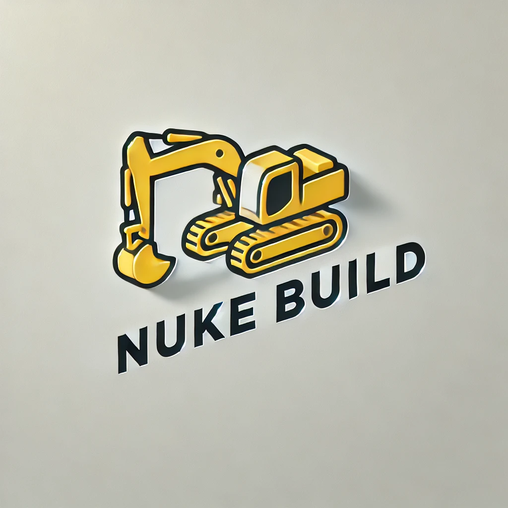

# Nuke Build: Supercharge Your DevOps Workflow with Code-Driven Automation



*[Kevin Slingerland, oktober 2024.](https://github.com/hanaim-devops/blog-student-naam)*
<hr/>

Installeer de aangeraden [mdlint](https://github.com/DavidAnson/markdownlint). Voeg je eerste plaatje en bronnen in.

# Intro

In de wereld van softwareontwikkeling is efficiëntie essentieel. Buildprocessen kunnen complex en tijdrovend zijn, vooral in grote projecten met meerdere afhankelijkheden. Nuke Build biedt een innovatieve oplossing door buildprocessen te automatiseren met C#-code. In deze blogpost ontdek je hoe Nuke Build je DevOps-workflow kan versnellen en centraliseren, en hoe je het kunt integreren in je bestaande CI/CD-pipelines.

## I

Nuke Build is een cross-platform buildautomatiseringstool die ontwikkelaars in staat stelt om buildprocessen te definiëren met behulp van reguliere C#-code. In tegenstelling tot traditionele buildtools zoals MSBuild of Make, die gebruikmaken van XML of Makefiles, maakt Nuke Build gebruik van de volledige kracht van het .NET-ecosysteem. Dit betekent dat je profiteert van typeveiligheid, IntelliSense en andere voordelen van moderne IDE's.


## Waarom kiezen voor Nuke Build 🚀

Nuke Build is een alternatief voor tools zoals MSBuild, Make of Cake. De voordelen zijn onder andere:

### Code-Driven Builddefinities

Met Nuke Build schrijf je je buildscripts in C#, wat zorgt voor:

- **Typeveiligheid**: Fouten worden tijdens het compileren opgespoord.
- **IDE-ondersteuning**: Gebruik van IntelliSense, debugging en code-navigatie.
- **Hergebruik**: Maak gebruik van bestaande bibliotheken en methoden.

_Voorbeeld van een eenvoudige target in Nuke_
```csharp
Target Clean => _ => _
    .Executes(() =>
    {
        EnsureCleanDirectory(OutputDirectory);
    });
```

### Naadloze Integratie met .NET

Nuke Build sluit aan op het .NET-ecosysteem:

- **NuGet-ondersteuning**: Eenvoudig pakketten beheren.
- **MSBuild-integratie**: Bouw naadloos je .NET-projecten.
- **Git-ondersteuning**:

### Developer Comfort

- **Geïntegreerde Documentatie en IDE Support**: Code completetion, (Remote)Debuggen en ....
- **Overzicht**: ....

---

## Aan de slag met Nuke Build

Alle code en voorbeelden in deze blog zijn terug te vinden in de [github repo]() evenals de volledige uitwerking.

### Vereisten

- .NET SDK 6.0 of hoger [Download .NET](https://dotnet.microsoft.com/en-us/download)
- *Optioneel: [IDE Extention]()*


### Aan de slag met Nuke: Installeren van de GlobalTool

Om te beginnen met nuke build installeren we eerst de GlobalTool, deze geeft ons toegang tot de nuke tool waar zich een aantal handige functies in bevinden maar om te beginnen gaan we een nieuw project opzetten

```shell
dotnet tool install Nuke.GlobalTool --global
```

```shell
nuke :setup
```


```csharp
class Build : NukeBuild
{
    public static int Main() => Execute<Build>(x => x.Compile);

    Target Clean => _ => _
        .Executes(() =>
        {
            DotNetClean();
        });

    Target Restore => _ => _
        .DependsOn(Clean)
        .Executes(() =>
        {
            DotNetRestore();
        });

    Target Compile => _ => _
        .DependsOn(Restore)
        .Executes(() =>
        {
            DotNetBuild(a => a.SetNoRestore(true));
        });

}
```

###


